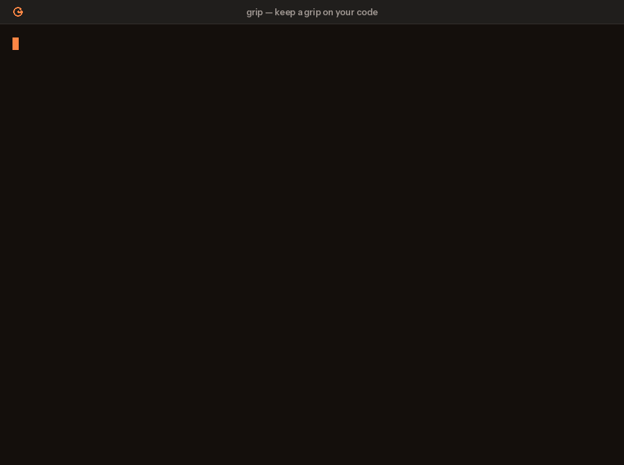

**Keep a grip on your code.** grip is a git hook that quizzes you about your own diff
before you commit or push it. Five questions, a Grip Score out of 100, and a pass mark you
choose. Below the mark, nothing goes upstream.

[](https://github.com/guilyx/grip/actions/workflows/ci.yml)
[](https://guilyx.github.io/grip/)
[](https://github.com/guilyx/grip/releases/latest)
[](LICENSE)

<table>
<tr>
<td align="center" width="33%"><h3>5 questions</h3>written from <em>your</em> diff, graded against a hidden rubric, 100 points</td>
<td align="center" width="33%"><h3>12 → 92</h3>the same diff blocked with lazy answers, through with real ones (<a href="docs/assets/demo.mp4">demo</a>)</td>
<td align="center" width="33%"><h3>0 new tools to learn</h3>a git hook, or <code>/grip</code> inside Claude Code, Codex, Gemini CLI, Cursor and friends</td>
</tr>
</table>

<table>
<tr>
<th width="50%">Without grip</th>
<th width="50%">With grip</th>
</tr>
<tr>
<td valign="top">

```text
$ git push
Enumerating objects: 14, done.
...
To github.com:acme/robot.git
   3f2a1c9..8e7d4b2  main -> main
```

Four hundred lines the assistant wrote, nobody on the team can explain, now upstream.

</td>
<td valign="top">

```text
$ git push
grip  5 questions about your push (pre-push). Pass mark: 70/100.

Q1/5 (behaviour) What happens to a cmd_vel message
     whose linear.x exceeds the new limit?
> it is clamped to the limit, not dropped, so the
> robot keeps moving at the max speed

...

Grip Score: 92/100  PASS
```

Same push, one minute later. You can explain it in the review because you just did.

</td>
</tr>
</table>



<sub>A commit blocked at 12/100, then accepted at 92/100. [Video version](docs/assets/demo.mp4). Recorded with the offline scripted provider, so questions are canned; a real model writes them from your diff.</sub>

## Why

Generated code, big refactors, late-night pastes: it is easy to ship a change you could
not explain in a code review. grip makes you explain it *before* it leaves your machine.
It is a lightweight forcing function, not a gate for correctness: the model asks about
behaviour, motivation, edge cases, risks and verification, and grades your answers against
a rubric it wrote from the diff.

The gap grip aims at is measured, not imagined. In METR's 2025 randomised trial,
experienced open-source developers using AI tools were [19% slower while believing they
were 20% faster](https://metr.org/blog/2025-07-10-early-2025-ai-experienced-os-dev-study/).
GitClear's analysis of 153 million changed lines found [code churn on track to double
since AI assistants arrived](https://www.gitclear.com/coding_on_copilot_data_shows_ais_downward_pressure_on_code_quality).
The [2024 DORA report](https://dora.dev/research/2024/dora-report/) linked higher AI
adoption to lower delivery stability, and the [2025 Stack Overflow survey](https://survey.stackoverflow.co/2025/ai)
put developer trust in AI output at a low. Every one of these tools checks the code. grip
is the only one that checks the human.

## Install

One command, no Python or package manager needed. It downloads the prebuilt binary for
your OS and CPU from the [latest release](https://github.com/guilyx/grip/releases/latest),
verifies its checksum, and puts `grip` (and a `git grip` alias) in `~/.local/bin`:

```bash
curl -fsSL https://raw.githubusercontent.com/guilyx/grip/main/install.sh | sh
```

Pin a version with `sh -s -- --version v0.1.0`, change the directory with `--dir`, remove
it with `--uninstall`. Linux and macOS, x86_64 and arm64. On Windows use the pre-commit
framework route below.

Then, in your repository:

```bash
grip init
```

That writes a commented `.grip.toml`, installs the pre-push hook and tells the coding
agents on your machine to run the quiz before they push. Commit the files and the team
shares the setup. Prefer to do it by hand? Two ways to wire it into git:

### Option A: native git hook

```bash
cd your-repo
grip install                  # pre-push (recommended)
grip install --stage pre-commit --stage pre-push   # both
```

### Option B: pre-commit framework

```yaml
# .pre-commit-config.yaml
repos:
  - repo: https://github.com/guilyx/grip
    rev: v0.1.0
    hooks:
      - id: grip          # runs at pre-push
      # - id: grip-commit # runs at pre-commit
```

```bash
pre-commit install --hook-type pre-push
```

### Inside a coding agent

grip is an [Agent Skill](https://agentskills.io). One command installs it into Claude
Code, Codex, Gemini CLI, Cursor, Windsurf, Cline, Copilot and friends:

```bash
npx skills add guilyx/grip -g
```

Then type `/grip` before you push. The agent relays the five questions, you answer, grip
grades; the skill forbids the agent from answering for you. Claude Code users can take the
plugin instead, which also blocks `git push` until the diff has passed:

```text
/plugin marketplace add guilyx/grip
/plugin install grip@grip
```

`grip agents` writes the rule file each agent on your machine reads (`AGENTS.md`,
`CLAUDE.md`, `GEMINI.md`, Cursor, Windsurf, Cline, Copilot) so it runs `grip check` before
every push. See the [docs](https://guilyx.github.io/grip/agents/) for the raw
`grip ask` / `grip grade` flow any agent can drive.

### Provider

Already using Claude Code, Codex or Gemini CLI? grip can reuse it, so there is no API key
and no extra bill:

```toml
# .grip.toml
provider = "claude-code"      # or "codex", or "gemini"
```

Otherwise grip talks to Anthropic by default: export `ANTHROPIC_API_KEY` (or run
`ant auth login`). For a local, free setup use Ollama:

```toml
# .grip.toml
provider = "ollama"
model = "qwen3:14b"
```

Any OpenAI-compatible API works with `provider = "openai"` plus `base_url` and
`OPENAI_API_KEY`.

## Use

Nothing to do: commit or push as usual. When grip runs, answer five questions in the
terminal. Pass the mark and the commit or push continues; fail it and it is blocked with
per-question feedback so you know what to go read.

```bash
grip quiz                     # quiz your staged changes right now, no hook needed
grip quiz --unpushed          # quiz everything not yet on a remote
grip quiz --provider fake     # try the flow offline with a dummy grader
grip status                   # hooks, last score, what has passed, configuration
grip skip && git push         # bypass once (GRIP_SKIP=1 and --no-verify work too)
grip skip --hours 1           # pause the hooks for a demo; grip resume cancels
```

A diff that passed is remembered for 24 hours, so a pre-push right after a pre-commit
does not ask again.

## Practice on Keep A Grip

[Keep A Grip](https://keepagrip.vercel.app) is a catalogue of ROS 2, robotics and AI
problems built for this loop: solve one with any assistant, then let grip quiz you on the
diff. Scores land on your dashboard; anyone can add a problem.

```bash
grip login kag_…                   # token from your dashboard
grip solve cmd-vel-safety-filter   # a repo with PROBLEM.md, pass mark preset
grip submit                        # tests, five questions, score reported
```

Only the score leaves your machine. See the [docs](https://guilyx.github.io/grip/keepagrip/).

## Configure

`.grip.toml` at the repository root, or `[tool.grip]` in `pyproject.toml`. Environment
variables (`GRIP_PASSING_SCORE=80`) and flags (`--passing-score 80`) override files.

```toml
passing_score = 70            # 0-100, the Grip Score you need
difficulty = "normal"         # easy | normal | hard
provider = "anthropic"        # anthropic | claude-code | codex | gemini | openai | ollama | fake
model = ""                    # empty = provider default (claude-opus-5 for anthropic)
effort = "medium"             # low | medium | high | xhigh | max | none
exclude = ["*.lock", "*.snap"]
max_diff_bytes = 200000
remember_passes_hours = 24
require_tty = false           # fail instead of skipping in non-interactive runs
fail_open = false             # let commits through when the provider is down
```

Full reference: [guilyx.github.io/grip](https://guilyx.github.io/grip/).

## How the score works

- The model reads the diff and writes exactly five questions, each with a hidden rubric.
- You answer each in a sentence or two.
- The model grades all five against the rubrics: 0 to 20 points each, summed to a
  Grip Score out of 100.
- Score at or above `passing_score` lets the commit or push through.

Only the diff (after `exclude`) and your answers are sent to the provider. Reports are
saved to `.git/grip/last-report.json`.

## When grip gets in the way

A one-line typo fix does not deserve five questions, and grip cannot tell a rename from a
rewrite. That is what the escape hatches are for: `grip skip` for one push,
`grip skip --hours 1` for a pairing session, `exclude` for generated files,
`remember_passes_hours` so a passed diff is not asked twice. Questions and grading come
from a language model, so they are sometimes unfair; the per-question feedback shows you
why, and `grip quiz` gives a fresh set. What has and has not been measured about the
quiz, and where it is known to be annoying, is on the
[honest numbers](https://guilyx.github.io/grip/honest-numbers/) page; the
[evals harness](evals/) behind it runs offline. Treat the Grip Score as a prompt to
re-read, not a verdict.

## Cite

If grip is part of a study or a course, please cite it ([CITATION.cff](CITATION.cff)):

```bibtex
@software{lejeune2026grip,
  author = {L., Erwin},
  title  = {grip: keep a grip on your code},
  year   = {2026},
  url    = {https://github.com/guilyx/grip}
}
```

## Contributing

Issues and pull requests are welcome. See [CONTRIBUTING.md](CONTRIBUTING.md) for the
development setup, and [SECURITY.md](SECURITY.md) for what data grip touches.

## Media

A [launch video](docs/assets/launch/grip-launch-1080p.mp4), the
[Product Hunt image](docs/assets/launch/grip-producthunt-1270x760.png) and the icon live
under `docs/assets/launch/`, all generated from the demo recording by
`scripts/launch/make_launch.py`. Use them freely. More on the
[media page](https://guilyx.github.io/grip/media/).

## License

[BSD-3-Clause](LICENSE). Copyright (c) 2026, Erwin L.
