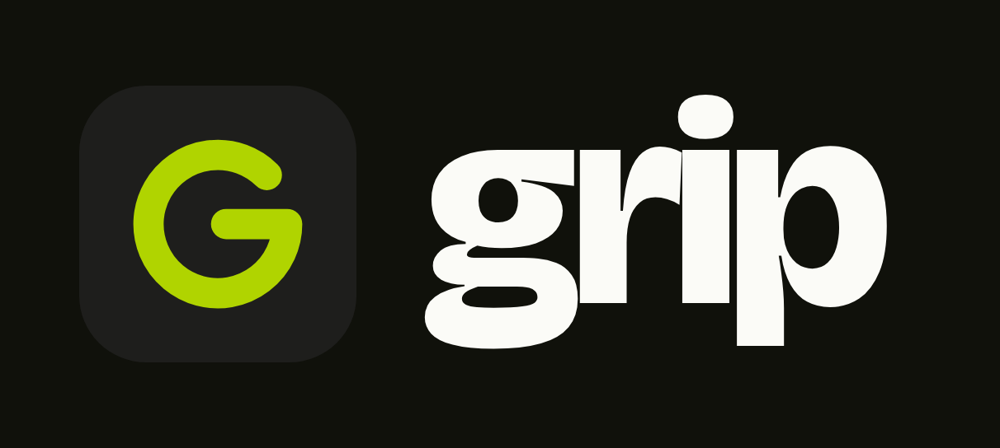
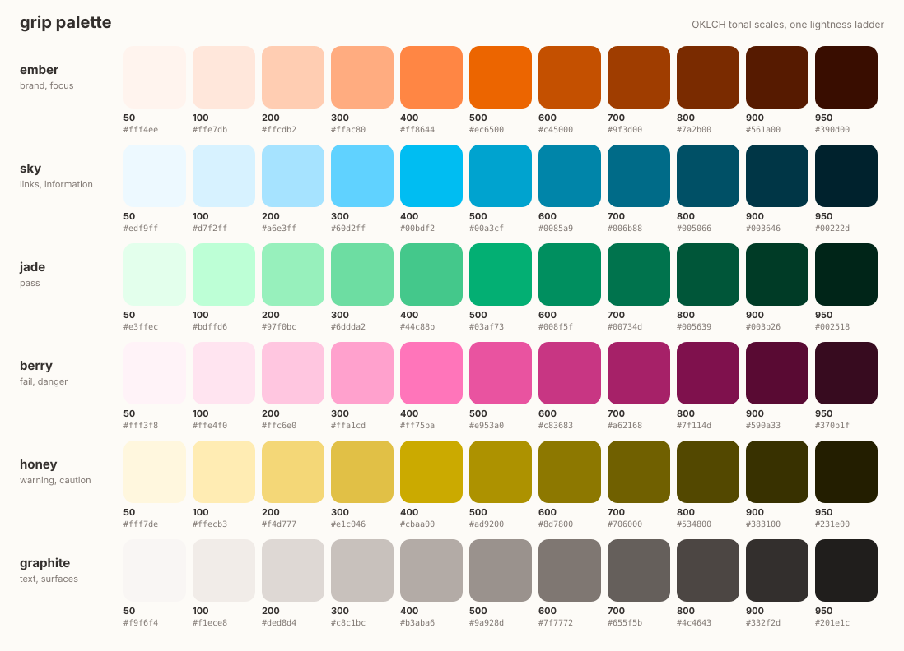

# grip identity

grip asks one thing of a developer: can you explain what you are about to ship? The
identity says the same thing with as little as possible. One mark, one loud colour, a
quiet neutral, a typeface with grip of its own, and numbers you can check.



## The idea

**A grip is a hold that is nearly closed.** The mark is a score ring drawn to 315 of 360
degrees, 87.5 percent, a pass but never a perfect one. A short bar turns the ring inward
into a **G**. The gap is the point: understanding is something you keep doing, not a box
you tick once.

The ring comes back everywhere the score does. The social card, the docs homepage and
the CLI's score all draw it the same way: a volt arc on a dark track, starting at twelve
o'clock and running clockwise.

## Mark

| File | Use it on |
| --- | --- |
| [`logo/mark.svg`](logo/mark.svg) | anything. Volt on a basalt tile. The default and the favicon. |
| [`logo/mark-light.svg`](logo/mark-light.svg) | dark or busy places where the tile needs to glow: basalt on volt |
| [`logo/mark-bare-volt.svg`](logo/mark-bare-volt.svg) | dark surfaces, no tile |
| [`logo/mark-bare-ink.svg`](logo/mark-bare-ink.svg) | light surfaces, no tile |
| [`logo/mark-bare-chalk.svg`](logo/mark-bare-chalk.svg) | photos and dark colour fields |
| [`logo/lockup-dark.png`](logo/lockup-dark.png), [`-light`](logo/lockup-light.png), [`-volt`](logo/lockup-volt.png) | mark and wordmark together |
| [`logo/og-card.png`](logo/og-card.png) | link previews, 1200 by 630 |

- **Construction.** On the 64 unit tile: ring radius 16, stroke 7, round caps, corner
  radius 15.4. The ring starts at 315 degrees and runs anticlockwise to 0; the bar runs
  from 0 degrees to just right of centre. `build.py` draws it, so it is never redrawn by
  hand.
- **Clear space.** Half the tile width on every side.
- **Smallest size.** 16 pixels with the tile, 20 without.
- **Don't** rotate it, outline it, put volt on white without the tile, close the ring, or
  set the wordmark in anything but Bricolage Grotesque.

## Colour



Five families, each an eleven-step tonal scale from 50 to 950.

| Family | Role | Signature step |
| --- | --- | --- |
| **volt** | brand, focus, pass | `volt-300` `#b0d400` |
| **tide** | links on light, information | `tide-700` |
| **flare** | fail, danger | `flare-500` |
| **amber** | warning | `amber-600` and darker |
| **basalt** | text and surfaces | `basalt-950` header, `chalk` page |

**Why volt.** Developer tools live in blue and purple. Chartreuse is the colour of a
highlighter, of grip tape, of a climbing hold you can see from the ground. It means
"look here" without meaning "error". It is also hard to use, which is why the scale and
the checks below exist.

### How the palette is made

[`build.py`](build.py) generates every colour. Nothing is picked from a colour wheel.

1. **OKLCH, not HSL.** In OKLCH equal lightness steps look equal to a person, and hue
   does not wander as chroma changes. HSL's "50 % lightness" yellow and blue differ by a
   factor of eight in luminance; OKLCH's do not.
2. **One lightness ladder.** Every family uses the same eleven lightness values, so
   `volt-600` and `flare-600` weigh the same on the page and swap without re-checking
   contrast.
3. **A chroma bell.** Chroma peaks mid-scale and keeps about a third at both ends, so
   pale tints are not chalky and deep shades are still olive, navy, wine, not grey.
4. **Hue drift.** Light steps lean slightly warm and dark steps slightly cool, as real
   pigments do (the Bezold-Brücke shift). Volt drifts 14 degrees, tide 8.
5. **Gamut mapping by chroma only.** When a colour falls outside sRGB, chroma drops until
   it fits. Lightness and hue never move, so the ladder stays true.
6. **A perceptual triad.** Volt, tide and flare sit at 124, 244 and 4 degrees: exactly
   120 apart. Basalt is a neutral tinted toward volt (hue 118, chroma 0.014), so grey
   surfaces still belong to the brand.

### What the palette has to pass

`build.py` refuses to write a palette that fails any of these. The full table with every
measured value is in [`palette.md`](palette.md).

- **Contrast, twice.** Every text pairing the docs use must clear a WCAG 2 ratio (7:1 for
  body text, 4.5:1 for the rest) and an APCA lightness contrast (Lc 90 for body text,
  60 for UI). WCAG 2 is the legal bar; APCA is the better predictor of what people can
  actually read, especially light text on dark.
- **Colour vision.** Pass and fail, pass and warning, info and fail must stay at least
  0.10 apart in OKLab (about five just-noticeable differences) under simulated
  protanopia, deuteranopia and tritanopia (Machado 2009, full severity).

Two decisions came straight out of those checks. Flare is raspberry, not orange-red:
at hue 22 it collapsed into volt under deuteranopia. And warnings use amber 600 or darker,
because volt and amber are close in hue and only lightness keeps them apart for everyone.

### Semantic rules

- **Never colour alone.** A score always says PASS or FAIL in words next to the colour.
- On light surfaces: pass `volt-600`, fail `flare-500`, warning `amber-700`, info `tide-700`.
- On dark surfaces: pass `volt-300`, fail `flare-400`, warning `amber-400`, info `tide-300`.
- Badges: the 100 step as background, the 800 or 900 step as text.
- Volt is a light colour. On a light page it appears as a tile, a highlight or a thick
  underline, never as text.

## Type

| Role | Face | Setting |
| --- | --- | --- |
| Display, wordmark | [Bricolage Grotesque](https://fonts.google.com/specimen/Bricolage+Grotesque) | 800, tracking -0.035em, line height 1.02 |
| Text | [Instrument Sans](https://fonts.google.com/specimen/Instrument+Sans) | 400 and 600, line height 1.6 |
| Code, numbers in UI | [JetBrains Mono](https://fonts.google.com/specimen/JetBrains+Mono) | 500 |

Bricolage's ink traps and tight curves give the wordmark a hand-cut feel that no default
sans has. Instrument Sans is calm and narrow enough for long reference pages. All three
are open source (SIL OFL) and served by Google Fonts.

## Voice

- **We, not I.** grip is a shared habit, not a scold.
- **Plain and short.** One idea per sentence. The README, the CLI and the docs all read
  like a colleague explaining, not like marketing.
- **Honest about limits.** We say what is measured and what is not
  ([honest numbers](../docs/honest-numbers.md)). Never claim more than the evals show.
- **No blame.** "Re-read the diff" rather than "you failed".

## Files and regeneration

```bash
python branding/build.py            # tokens.css, tokens.json, palette.svg, palette.md, the marks
python branding/build.py --check    # what CI runs: stale files or failed checks exit 1
node branding/render.mjs            # lockups and the social card (needs Playwright + Chromium)
```

`build.py` also writes `docs/stylesheets/tokens.css` and the marks under
`docs/assets/brand/`, so the docs site always uses the generated palette. Edit the
families in `build.py`, never the generated files.
