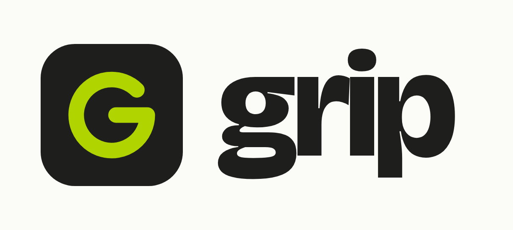

# Brand

Everything here is generated from one file, `branding/build.py`, and checked before it is
written. The full guide, the source files and the measured report live in the
[`branding/`](https://github.com/guilyx/grip/tree/main/branding) folder.

{ .card }

{ .card }

## The mark

A grip is a hold that is nearly closed. The mark is a score ring drawn to 315 of 360
degrees, 87.5 percent: a pass, never a perfect one. A short bar turns it inward into a
**G**. The same ring shows the Grip Score on the homepage and on the social card.

| File | Use |
| --- | --- |
| [`mark.svg`](assets/brand/mark.svg) | default, volt on a basalt tile, also the favicon |
| [`mark-light.svg`](assets/brand/mark-light.svg) | basalt on volt |
| [`mark-bare-volt.svg`](assets/brand/mark-bare-volt.svg) | no tile, for dark surfaces |
| [`mark-bare-ink.svg`](assets/brand/mark-bare-ink.svg) | no tile, for light surfaces |
| [`og-card.png`](assets/brand/og-card.png) | link previews, 1200 × 630 |

Keep half the tile's width clear around it. The smallest size is 16 pixels with the tile.
Never rotate it, close the ring, or set the wordmark in anything but Bricolage Grotesque.

## Colour

<i style="background:var(--grip-volt-300)"></i><b>volt</b> brand, focus, pass <code>volt-300</code>

<i style="background:var(--grip-tide-500)"></i><b>tide</b> links, information <code>tide-500</code>

<i style="background:var(--grip-flare-500)"></i><b>flare</b> fail, danger <code>flare-500</code>

<i style="background:var(--grip-amber-600)"></i><b>amber</b> warning <code>amber-600</code>

<i style="background:var(--grip-basalt-950)"></i><b>basalt</b> text, surfaces <code>basalt-950</code>

<i style="background:var(--grip-chalk)"></i><b>chalk</b> the page <code>chalk</code>

Developer tools live in blue and purple. Volt is the colour of a highlighter, of grip
tape, of a climbing hold you can spot from the ground: "look here" without "error".

### How it is made

1. **OKLCH, not HSL.** Equal lightness steps look equal, and hue holds still as chroma
   changes.
2. **One lightness ladder** for every family, so step 600 weighs the same in volt and in
   flare.
3. **A chroma bell**: colour peaks mid-scale and keeps a third at the ends, so deep shades
   are olive, navy and wine, not grey.
4. **Hue drift**: tints lean warm and shades lean cool, as pigments do.
5. **Gamut mapping by chroma only**: lightness and hue never move to fit sRGB.
6. **A perceptual triad**: volt, tide and flare sit at 124, 244 and 4 degrees, exactly 120
   apart. Basalt is a neutral tinted toward volt.

### What it has to pass

The generator refuses to write a palette that fails any check. 28 checks run today.

- **Contrast, measured twice.** Every text pairing on this site clears WCAG 2 (7:1 for
  body text, 4.5:1 elsewhere) and an APCA lightness contrast (Lc 90 for body text, 60 for
  interface text). That includes every syntax colour in the code blocks.
- **Colour vision.** Pass and fail, pass and warning, info and fail stay at least five
  just-noticeable differences apart under simulated protanopia, deuteranopia and
  tritanopia.

Two choices came out of those checks, not taste. Fail is raspberry rather than orange-red,
because at an orange hue it collapsed into volt for deuteranopes. Warnings use amber 600
or darker, so they differ from pass by lightness, which every eye can see.

!!! tip "Never colour alone"
    A score always says PASS or FAIL in words. Colour is the second signal, not the only
    one.

## Type

| Role | Face | Setting |
| --- | --- | --- |
| Display and wordmark | Bricolage Grotesque | 800, tracking −0.035em |
| Text | Instrument Sans | 400 and 600, line height 1.6 |
| Code | JetBrains Mono | 500 |

All three are open source and served by Google Fonts.

## Voice

- **We, not I.** grip is a shared habit, not a scold.
- **Plain and short.** One idea per sentence.
- **Honest about limits.** Say what is measured and what is not.
- **No blame.** "Re-read the diff", never "you failed".
