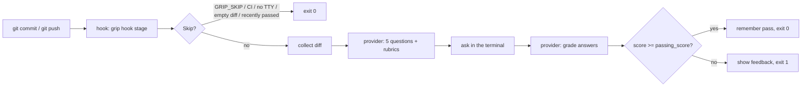

# How it works

## The flow

1. **Collect the diff.** For `pre-commit` that is the staged changes. For `pre-push` grip
   reads the refs git passes on stdin and diffs each remote SHA against the local SHA; for
   a brand-new branch it diffs against the parent of the oldest commit not on any remote.
   Under the pre-commit framework it uses `PRE_COMMIT_FROM_REF` / `PRE_COMMIT_TO_REF`.
   Paths matching `exclude` are dropped and the patch is capped at `max_diff_bytes`.
2. **Generate questions.** One request to the provider returns a summary plus exactly five
   questions. Each comes with a hidden rubric: the points a complete answer must cover.
3. **Ask.** Questions are shown one at a time on the controlling terminal. You answer in a
   line; an empty line skips (and scores zero).
4. **Grade.** A second request sends the diff, the questions, the rubrics and your answers.
   Each answer gets 0 to 20 points and a sentence of feedback.
5. **Decide.** The Grip Score is the sum, 0 to 100. At or above `passing_score` the hook
   exits 0 and the diff's digest is remembered; below it the hook exits 1 and the
   commit or push is blocked.

## The Grip Score

| Part | Value |
| --- | --- |
| Questions per quiz | 5, always |
| Points per question | 0 to 20 |
| Grip Score | sum, 0 to 100 |
| Default pass mark | 70 |

Grading is deliberately rubric-based: the questions are written *with* the rubric, before
you answer, so the grader is checking substance rather than improvising. Spelling, grammar
and brevity are explicitly ignored in the grading prompt.

`difficulty` shifts both ends: `easy` asks about visible behaviour and grades leniently,
`hard` probes failure modes and interactions with code outside the diff and grades strictly.

## What leaves your machine

Only two things are sent to the provider: the diff (after exclusions and truncation) and
your answers. No history, no other files, no telemetry. The diff is wrapped in `<diff>`
delimiters and the model is told to treat anything inside as data, never as instructions.

Reports (`questions`, `answers`, `grades`, `score`) are written to
`.git/grip/last-report.json`, or to the path given with `--report`. Passed digests live in
`.git/grip/passed.json`.

## When grip steps aside

grip exits 0 without asking anything when:

- `GRIP_SKIP` is set to a truthy value, or git runs with `--no-verify`;
- `CI` is set (hooks in CI have nobody to answer);
- there is no interactive terminal and `require_tty` is false (the default);
- the diff is empty after exclusions;
- the exact same diff passed within `remember_passes_hours`.

Provider failures (no key, network down, model unavailable) **block** by default so a
broken setup is noticed rather than silently bypassed. Set `fail_open = true` to prefer
availability over strictness.
