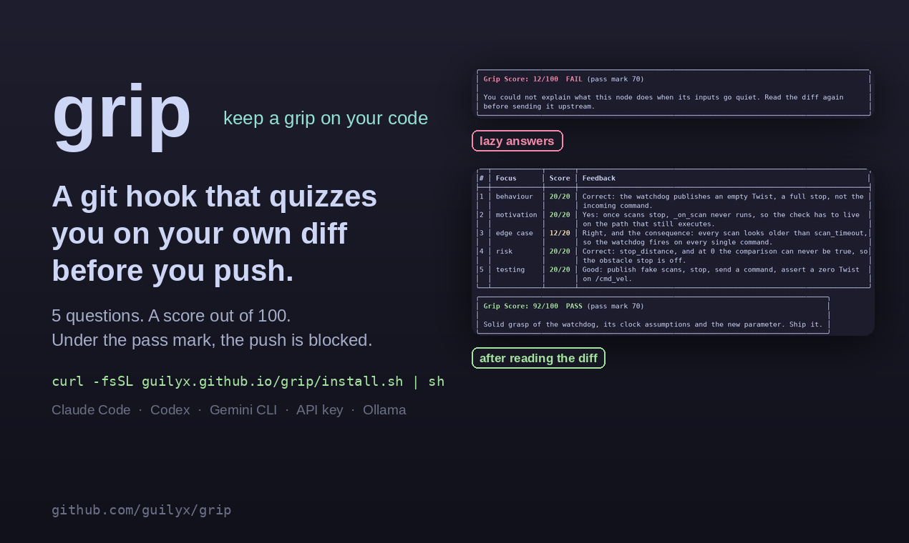
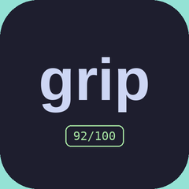

# Media

Everything here is generated from the recorded demo by `scripts/launch/make_launch.py`, so
it stays in sync with the terminal output. Use it freely when you write or talk about grip.

## Launch video

<video controls muted playsinline width="100%" poster="assets/launch/grip-producthunt-1270x760.png">
  <source src="assets/launch/grip-launch-1080p.mp4" type="video/mp4">
</video>

83 seconds, 1080p, H.264. Title cards around the full demo. It has a silent audio track,
so add music before you upload it anywhere that expects sound.

## Demo

<video controls muted playsinline width="100%">
  <source src="assets/demo.mp4" type="video/mp4">
  <source src="assets/demo.webm" type="video/webm">
</video>

The same 53 second recording as the GIF on the front page: one commit blocked at 12/100,
then accepted at 92/100. Also available as [GIF](assets/demo.gif),
[WebM](assets/demo.webm) and an [asciinema cast](assets/demo.cast).

## Images



[1270 × 760 gallery image](assets/launch/grip-producthunt-1270x760.png), the size Product
Hunt and most link previews want.



[240 × 240 icon](assets/launch/grip-thumbnail-240.png), also at
[480 × 480](assets/launch/grip-thumbnail-480.png).

## Regenerating

```bash
pip install -e ".[demo]"
python scripts/demo/make_demo.py all      # re-record and render the demo
python scripts/launch/make_launch.py      # rebuild demo.mp4 and everything under assets/launch
```

The demo script needs `bash` and a pseudo-terminal. The launch script needs an ffmpeg
with libx264, which the `demo` extra provides through `imageio-ffmpeg`.
